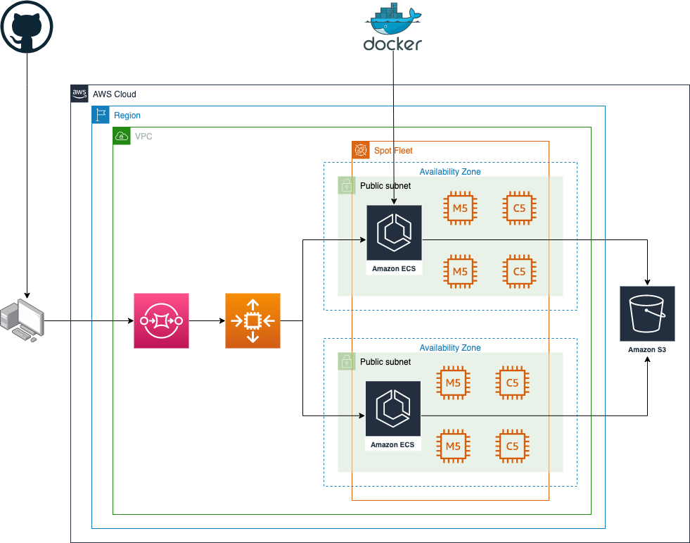

1. Download the source directory from the [Github repository](https://github.com/noelnamai/terraform-nextflow-batch):

    ```
    $ git clone https://github.com/noelnamai/terraform-nextflow-batch.git
    ```

    > The directory structure of `terraform-nextflow-batch` directory is shown below:

    ```
    terraform-nextflow-batch
    ├── README.md
    ├── docker
    │   ├── bcftools
    │   │   └── Dockerfile
    │   ├── fastqc
    │   │   └── Dockerfile
    │   ├── samtools
    │   │   └── Dockerfile
    │   ├── seqtk
    │   │   └── Dockerfile
    │   ├── trimmomatic
    │   │   └── Dockerfile
    │   └── vep
    │       └── Dockerfile
    ├── iac
    │   ├── compute.tf
    │   ├── errored.tfstate
    │   ├── iam.tf
    │   ├── network.tf
    │   ├── outputs.tf
    │   ├── providers.tf
    │   ├── storage.tf
    │   ├── terraform.tfstate
    │   ├── terraform.tfstate.backup
    │   └── vars.tf
    ├── images
    │   └── aws-batch-infrastructure.png
    ├── nextflow
    │   ├── main.nf
    │   ├── modules
    │   │   ├── bam_prep.nf
    │   │   ├── bam_qc.nf
    │   │   ├── dna_alignment.nf
    │   │   ├── fastq_prep.nf
    │   │   ├── fastq_qc.nf
    │   │   ├── variant_annotation.nf
    │   │   └── variant_discovery.nf
    │   └── nextflow.config
    └── packer
        ├── aws-amzn2.pkr.hcl
        └── user-data.sh
    ```

2. Install the latest version of the [AWS Command Line Interface (AWS CLI)](https://docs.aws.amazon.com/cli/latest/userguide/getting-started-install.html):

    ```
    $ curl "https://awscli.amazonaws.com/awscli-exe-linux-x86_64.zip" -o "awscliv2.zip"
    $ unzip awscliv2.zip
    $ sudo ./aws/install
    ```

3. Configure the [AWS account](https://docs.aws.amazon.com/cli/latest/userguide/cli-configure-files.html) and select an appropriate `region` and `profile-name`:

    ```
    $ aws configure set region us-east-1 --profile profile-name

    AWS Access Key ID [None]: XXXXXXXXXXXXXXXXXXXX
    AWS Secret Access Key [None]: XXXXXXXXXXXXXXXXXXXX
    Default region name [None]: us-east-1
    Default output format [None]: json
    ```

4. Install [Packer](https://learn.hashicorp.com/tutorials/packer/get-started-install-cli?in=packer/docker-get-started):

    ```
    $ curl -fsSL https://apt.releases.hashicorp.com/gpg | sudo apt-key add -
    $ sudo apt-add-repository "deb [arch=amd64] https://apt.releases.hashicorp.com $(lsb_release -cs) main"
    $ sudo apt-get update && sudo apt-get install packer
    ```

5. Use Packer to create a new [Amazon Machine Images (AMI)](https://docs.aws.amazon.com/AWSEC2/latest/UserGuide/AMIs.html):

    > *Change the `region` and `profile` in the `packer/aws-amzn2.pkr.hcl` file to match the values selected above.*

    ```
    $ cd packer
    $ packer init .
    $ packer build aws-amzn2.pkr.hcl
    ```

6. Install [terraform](https://learn.hashicorp.com/tutorials/terraform/install-cli):

    ```
    $ sudo apt-get update && sudo apt-get install -y gnupg software-properties-common curl
    $ curl -fsSL https://apt.releases.hashicorp.com/gpg | sudo apt-key add -
    $ sudo apt-add-repository "deb [arch=amd64] https://apt.releases.hashicorp.com $(lsb_release -cs) main"
    $ sudo apt-get update && sudo apt-get install terraform
    ```

7. Build the [AWS Batch Infrastructure](https://aws.amazon.com/batch/) by running the following `terraform` commands:

    > *Change the values of the `profile` and `key_name` in the `iac/vars.tf` file and change the `bucket` name for both `tf_batch_data_bucket` and `tf_batch_work_bucket`*

    ```
    $ cd iac
    $ terraform init
    $ terraform apply
    ```

    

8. Install [Nextflow](https://www.nextflow.io/docs/latest/getstarted.html) and move the `nextflow` file to a directory accessible by the `$PATH` variable.

    > *Nextflow requires Bash 3.2 (or later) and Java 11 (or later, up to 18) to be installed.*

    ```
    $ curl -s https://get.nextflow.io | bash
    $ chmod +x nextflow
    $ nextflow self-update
    ```

9. Set default AWS `profile` for `nextflow`:

    ```
    $ echo "export AWS_PROFILE=profile-name" >> ~/.bash_profile
    $ source ~/.bash_profile
    ```

    > The [Amazon S3](https://aws.amazon.com/s3/) `data bucket` should have the following structure and files:

    ```
    s3://batch-data-bucket
    └── data
        ├── dbsnp
        │   ├── Homo_sapiens_assembly38.dbsnp138.vcf
        │   └── Homo_sapiens_assembly38.dbsnp138.vcf.idx
        ├── genome
        │   ├── Homo_sapiens_assembly38.dict
        │   ├── Homo_sapiens_assembly38.fasta
        │   └── Homo_sapiens_assembly38.fasta.fai
        ├── bwa
        │   ├── Homo_sapiens_assembly38.fasta.amb
        │   ├── Homo_sapiens_assembly38.fasta.ann
        │   ├── Homo_sapiens_assembly38.fasta.bwt
        │   ├── Homo_sapiens_assembly38.fasta.fai
        │   ├── Homo_sapiens_assembly38.fasta.pac
        │   └── Homo_sapiens_assembly38.fasta.sa
        └── fastqs
            ├── ERR034520_1.fastq
            └── ERR034520_2.fastq
    ```

10. Run the workflow using the following command:

    > *Run `nextflow run main.nf -work-dir s3://batch-work-bucket/ --downsample true` to downsample the data. This is useful for debuging purposes.*

    ```
    $ nextflow run main.nf -work-dir s3://batch-work-bucket/ --downsample true      
    N E X T F L O W  ~  version 22.04.4
    Launching `main.nf` [stoic_ekeblad] DSL2 - revision: 577594cad8

    G E R M L I N E  V A R I A N T  D I S C O V E R Y
    =================================================
    BWA     : BWA 0.7.12
    Annovar : Annovar 4.18
    Picard  : Picard 2.18.25
    Samtools: Samtools 1.15.1
    GATK    : GenomeAnalysisTK 4.1.3.0

    executor >  awsbatch (412)
    [4c/6745a8] process > fastq_prep:sample_fastqs (1)             [100%] 1 of 1 ✔
    [4f/213ee9] process > fastq_prep:trim_adapters (1)             [100%] 1 of 1 ✔
    [ed/09b905] process > fastq_qc:fastqc (2)                      [100%] 2 of 2 ✔
    [92/9679af] process > dna_alignment:align_reads (1)            [100%] 1 of 1 ✔
    executor >  awsbatch (412)
    [4c/6745a8] process > fastq_prep:sample_fastqs (1)             [100%] 1 of 1 ✔
    [4f/213ee9] process > fastq_prep:trim_adapters (1)             [100%] 1 of 1 ✔
    [ed/09b905] process > fastq_qc:fastqc (2)                      [100%] 2 of 2 ✔
    [92/9679af] process > dna_alignment:align_reads (1)            [100%] 1 of 1 ✔
    [ff/ff2437] process > dna_alignment:sam2bam (1)                [100%] 1 of 1 ✔
    [0c/e23abc] process > dna_alignment:index_bam (1)              [100%] 1 of 1 ✔
    [03/516b9f] process > bam_prep:split_bam (1)                   [100%] 1 of 1 ✔
    [09/99c33f] process > bam_prep:add_read_groups (99)            [100%] 100 of 100 ✔
    [38/2141c2] process > bam_prep:index_splitted_bam (100)        [100%] 100 of 100 ✔
    [6d/05e612] process > bam_qc:mapping_stats (1)                 [100%] 1 of 1 ✔
    [6e/c14969] process > variant_discovery:call_variants (100)    [100%] 100 of 100 ✔
    [e3/6b6263] process > variant_discovery:filter_variants (100)  [100%] 100 of 100 ✔
    [4d/56106d] process > variant_discovery:merge_vcfs (1)         [100%] 1 of 1 ✔
    [c0/60c3f2] process > variant_discovery:sort_vcf (1)           [100%] 1 of 1 ✔
    [dc/e5303e] process > variant_annotation:annotate_variants (1) [100%] 1 of 1 ✔
    Completed at: 01-Jul-2022 22:10:42
    Duration    : 4h 18m 2s
    CPU hours   : 83.3
    Succeeded   : 412
    ```
