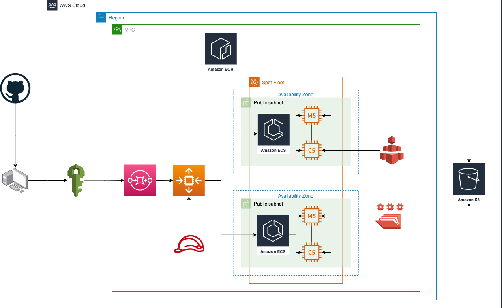

1. Download the source directory from the [Github repository](https://github.com/noelnamai/terraform-nextflow-batch):

    ```
    $ git clone https://github.com/noelnamai/terraform-nextflow-batch.git
    ```

    > The directory structure of `terraform-nextflow-batch` directory is shown below:

    ```
    terraform-nextflow-batch
    ├── README.md
    ├── docker
    │   ├── fastqc
    │   ├── samtools
    │   ├── seqtk
    │   └── trimmomatic
    ├── images
    │   └── aws-batch-infrastructure.png
    ├── nextflow
    │   ├── main.nf
    │   ├── modules
    │   ├── nextflow.config
    │   └── reports
    ├── packer
    │   ├── aws-amzn2.pkr.hcl
    │   └── user-data.sh
    ├── terraform
    │   ├── compute.tf
    │   ├── ecr.tf
    │   ├── iam.tf
    │   ├── monitoring.tf
    │   ├── network.tf
    │   ├── outputs.tf
    │   ├── providers.tf
    │   ├── storage.tf
    │   ├── terraform.tfstate
    │   ├── terraform.tfstate.backup
    │   └── vars.tf
    └── vault
        ├── vault
        ├── vault-cluster-vault.json
        └── vault.config
    ```

2. Install the latest version of the [AWS Command Line Interface (AWS CLI)](https://docs.aws.amazon.com/cli/latest/userguide/getting-started-install.html):

    ```
    $ curl "https://awscli.amazonaws.com/awscli-exe-linux-x86_64.zip" -o "awscliv2.zip"
    $ unzip awscliv2.zip
    $ sudo ./aws/install
    ```

3. Configure the [AWS account](https://docs.aws.amazon.com/cli/latest/userguide/cli-configure-files.html) and select an appropriate `region` and `profile-name`:

    ```
    $ aws configure set region us-east-1 --profile profile-name

    AWS Access Key ID [None]: XXXXXXXXXXXXXXXXXXXX
    AWS Secret Access Key [None]: XXXXXXXXXXXXXXXXXXXX
    Default region name [None]: us-east-1
    Default output format [None]: json
    ```

4. Install [Vault](https://developer.hashicorp.com/vault/docs/install). HashiCorp Vault is an identity-based secrets and encryption management system. This can be used to manage credentials during local developement and avoid credential leaks to GitHub.

    ```
    $ vault operator init
    $ vault server -config=vault.config
    ```

    Setup the following under `secrets` with path `developement/aws`:

    ```
    AWS_USER_ID
    AWS_KEY_NAME
    AWS_ACCESS_KEY_ID
    AWS_DEFAULT_REGION
    AWS_SECRET_ACCESS_KEY
    ```

5. Install [Packer](https://learn.hashicorp.com/tutorials/packer/get-started-install-cli?in=packer/docker-get-started):

    ```
    $ curl -fsSL https://apt.releases.hashicorp.com/gpg | sudo apt-key add -
    $ sudo apt-add-repository "deb [arch=amd64] https://apt.releases.hashicorp.com $(lsb_release -cs) main"
    $ sudo apt-get update
    $ sudo apt-get install packer
    ```

6. Use Packer to create a new [Amazon Machine Images (AMI)](https://docs.aws.amazon.com/AWSEC2/latest/UserGuide/AMIs.html):

    > *Change the `region` and `profile` in the `packer/aws-amzn2.pkr.hcl` file to match the values selected above.*

    ```
    $ cd packer
    $ packer init .
    $ packer build aws-amzn2.pkr.hcl
    ```

7. Install [terraform](https://learn.hashicorp.com/tutorials/terraform/install-cli):

    ```
    $ sudo apt-get update && sudo apt-get install -y gnupg software-properties-common curl
    $ curl -fsSL https://apt.releases.hashicorp.com/gpg | sudo apt-key add -
    $ sudo apt-add-repository "deb [arch=amd64] https://apt.releases.hashicorp.com $(lsb_release -cs) main"
    $ sudo apt-get update
    $ sudo apt-get install terraform
    ```

8. Build the [AWS Batch Infrastructure](https://aws.amazon.com/batch/) by running the following `terraform` commands:

    > *Change the values of the `profile` and `key_name` in the `terraform/vars.tf` file and change the `bucket` name for both `tf_batch_data_bucket` and `tf_batch_work_bucket`*

    > *To use [Amazon EC2 Spot Instances](https://aws.amazon.com/ec2/spot/), change aws_batch_compute_environment > compute_resources > type to "SPOT" in `compute.tf`.*

    ```
    $ cd terraform
    $ terraform init
    $ terraform apply
    ```

    

9. Install [Nextflow](https://www.nextflow.io/docs/latest/getstarted.html) and move the `nextflow` file to a directory accessible by the `$PATH` variable.

    > *Nextflow requires Bash 3.2 (or later) and Java 11 (or later, up to 18) to be installed.*

    ```
    $ cd nextflow
    $ curl -s https://get.nextflow.io | bash
    $ chmod +x nextflow
    $ nextflow self-update
    ```

10. Set default AWS `profile` for `nextflow`:

    ```
    $ echo "export AWS_PROFILE=profile-name" >> ~/.bash_profile
    $ source ~/.bash_profile
    ```

    > The [Amazon S3](https://aws.amazon.com/s3/) `data bucket` should have the following structure and files:

    ```
    s3://batch-data-bucket-virginia
    └── data
        ├── dbsnp
        │   ├── Homo_sapiens_assembly38.dbsnp138.vcf
        │   └── Homo_sapiens_assembly38.dbsnp138.vcf.idx
        ├── genome
        │   ├── Homo_sapiens_assembly38.dict
        │   ├── Homo_sapiens_assembly38.fasta
        │   └── Homo_sapiens_assembly38.fasta.fai
        ├── bwa
        │   ├── Homo_sapiens_assembly38.fasta.amb
        │   ├── Homo_sapiens_assembly38.fasta.ann
        │   ├── Homo_sapiens_assembly38.fasta.bwt
        │   ├── Homo_sapiens_assembly38.fasta.fai
        │   ├── Homo_sapiens_assembly38.fasta.pac
        │   └── Homo_sapiens_assembly38.fasta.sa
        └── fastqs
            ├── ERR034520_1.fastq
            └── ERR034520_2.fastq
    ```

11. Run the workflow using the following command:

    > *Run `nextflow run main.nf -work-dir s3://batch-work-bucket-virginia/ --downsample true` to downsample the data. This is useful for debuging purposes.*

    ```
    $ nextflow run main.nf -work-dir s3://batch-work-bucket-virginia/ --downsample true
    N E X T F L O W  ~  version 22.10.4
    Launching `main.nf` [sick_goldwasser] DSL2 - revision: 76196263c0

    G E R M L I N E  V A R I A N T  D I S C O V E R Y
    =================================================
    BWA     : BWA 0.7.12
    Annovar : Annovar 4.18
    Picard  : Picard 2.18.25
    Samtools: Samtools 1.15.1
    GATK    : GenomeAnalysisTK 4.1.3.0

    executor >  awsbatch (411)
    [skipped  ] process > fastqPrep:sample_fastqs (1)      [100%] 1 of 1, stored: 1 ✔
    [92/9b883c] process > fastqPrep:trim_adapters (1)      [100%] 1 of 1 ✔
    [5b/861e91] process > fastqQC:fastqc (1)               [100%] 2 of 2 ✔
    [c1/6baa36] process > dnaAlignment:align_reads (1)     [100%] 1 of 1 ✔
    [27/08c6b9] process > dnaAlignment:sam2bam (1)         [100%] 1 of 1 ✔
    [skipped  ] process > fastqPrep:sample_fastqs (1)      [100%] 1 of 1, stored: 1 ✔
    [92/9b883c] process > fastqPrep:trim_adapters (1)      [100%] 1 of 1 ✔
    [5b/861e91] process > fastqQC:fastqc (1)               [100%] 2 of 2 ✔
    [c1/6baa36] process > dnaAlignment:align_reads (1)     [100%] 1 of 1 ✔
    [27/08c6b9] process > dnaAlignment:sam2bam (1)         [100%] 1 of 1 ✔
    [e3/217307] process > dnaAlignment:index_bam (1)       [100%] 1 of 1 ✔
    [78/f695e7] process > bamPrep:split_bam (1)            [100%] 1 of 1 ✔
    [bb/d7c72d] process > bamPrep:add_read_groups (98)     [100%] 100 of 100 ✔
    [cf/d5361d] process > bamPrep:index_splitted_bam (100) [100%] 100 of 100 ✔
    [7a/f47d28] process > bamQC:mapping_stats (1)          [100%] 1 of 1 ✔
    [d9/3f04fa] process > variantDiscovery:call_variant... [100%] 100 of 100 ✔
    [b6/f3efb2] process > variantDiscovery:filter_varia... [100%] 100 of 100 ✔
    [43/de3c5f] process > variantDiscovery:merge_vcfs (1)  [100%] 1 of 1 ✔
    [9d/24e2c1] process > variantDiscovery:sort_vcf (1)    [100%] 1 of 1 ✔
    [9f/138f0f] process > variantAnnotation:annotate_va... [100%] 1 of 1 ✔
    Completed at: 11-Feb-2023 22:09:57
    Duration    : 2h 57m 57s
    CPU hours   : 77.4
    Succeeded   : 411
    ```
    